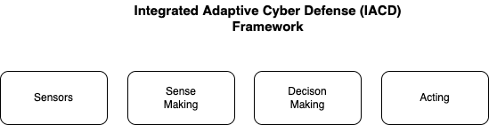

# Demo Use Cases

This will make more sense once it's filled in

## IACD Framework
The demo use cases will follow a modular functional framework
from Integrated Adaptive Cyber Defense (IACD).
---

Figure 1

---
IACD defines a strategy and framework to adopt
an extensible, adaptive approach.
Their goal is to dramatically change the timeline and effectiveness of
cyber defense via integration, automation, orchestration
and sharing of machine-readable cyber threat information.
Standard interfaces promote interoperability which is crucial
so that solutions developed for one organization can be exchanged
and useable by the wider community.

- **sensing** is gathering data. Some examples in our use cases include SBOMs, VEXs, and CVEs - all of which are data about the security posture of enterprise devices. Other examples include data from security devices such as routers, firewalls, intrusion detection systems, etc.
- **sense making** is integrating across multiple, disparate sources of information making the data meaningful. Stixshifter is one example of transforming data - in this case transforming vendor-specific  data into standard STIX observables. PACE is another example where SBOMs, VEXs, and CVEs are combined to give the security posture for a device. Automating the determination of risk with algorithms like Hubbard/Sieresen or FAIR would be another example of sense making. Value Stream Management is another sense-making mechanism for providing prioritization data based on business value of the alternative.
- **decision making** is evaluating alternative courses of action and making a choice among them. STIX Courses of Action and CACAO playbooks are mechanisms to document, share, and automate decision making based on the sensing and sense-making data.
- **acting** is sending the command and control to do things as a result of the decision making. OpenC2 is a standardized language for the command and control of technologies that provide or support cyber defenses.

## Big Picture Ideal Use Case

need to create

## Specific use case called whatever

### demo 1 of whatever (eg between two systems of single participant)

### demo 2 of whatever (eg between participant1 and participant2)

### ... demo N of whatever

## Next use case of this other thing

### demo 1 of this other thing

#### ...

## Return to Home
[return to Home](../index.md)
