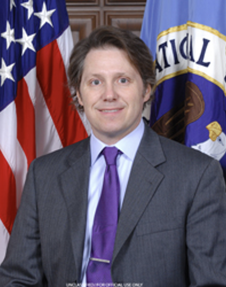

# Neal Ziring Keynote

## Keynote Title: TBD

## Neal Ziring Bio

Mr. Neal Ziring is the Technical Director
for the National Security Agency’s Cybersecurity Directorate (CSD),
serving as a technical advisor to the Cybersecurity Director,
Deputy Director, and other senior leadership.  
Mr. Ziring is responsible for
setting the technical direction across
many parts of the cybersecurity mission space,
engineering and operations.  
Mr. Ziring tracks technical activities,
promotes technical health of the staff,
and acts as liaison to various industry, intelligence,
academic, and government partners.  
Prior to the formation of the Cybersecurity Directorate,
Mr. Ziring served 3 years as
Technical Director of the Capabilities Directorate.

His personal expertise areas include security automation, IPv6,
cloud computing, cross-domain information exchange, and
data access control, and cyber defense.

Prior to coming to NSA in 1988, Neal worked at AT&T Bell Labs.  
He has BS degrees in Computer Science and Electrical Engineering,
and an MS degree in Computer Science,
all from Washington University in St. Louis.
