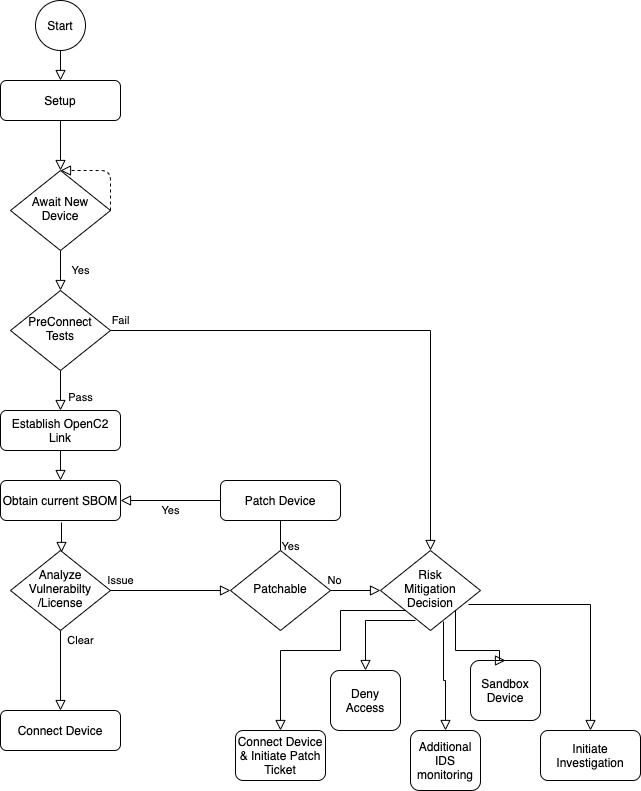

# Results for the Comply to Connect Use Case

## Use Case
This was the original use case in the first
Cybersecurity Automation Workshop.

The areas colored in green are where results were demonstrated
at this workshop.
Dark green for actual interfaces, light green for functionality
demonstrated but handwaving for the interfaces.

Previous workshops had demonstrated end devices
retreiving SBOMs as part of this use case.
This workshop was the first where the decision making was
demonstrated - in particular the security posture as retrieved
from PACE systems was demonstrated by:
- HII
- Cybeats
- Fortress
- etc

Projects and organizations that demonstrated in this area were:
- sFractal blah blah
- etc

## Results
