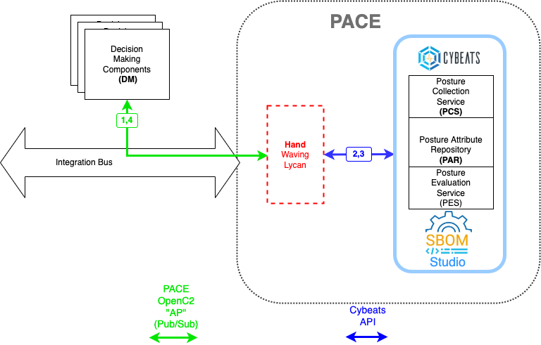

# Cybeats Sweat Equity

[Cybeats](https://www.cybeats.com/)
innovative security suites
give business leaders visibility and control
over the materials and technology in their products.
[SBOM Studio](https://www.cybeats.com/sbom-studio)
gives transparency into your software’s reputation,
nature and popularity with cybersecurity insights
for the entire product lifecycle using SBOMs.

For the June 2022 Cybersecurity Automation Workshop,
Cybeats will provide software tools, infrastructure support,
and in-person participation.

Cybeats SBOM Studio will be used to demonstrate
[Posture Attribute Collection & Evaluation (PACE) use cases.](https://github.com/opencybersecurityalliance/PACE/tree/main/docs/UseCases)
Since the PACE OpenC2 interfaces are still being defined,
liberal use of the hand-waving lycan will be used
to convert from the PACE interface to the Cybeats APIs.

The use cases which will be demonstrated are:
* [Command inserting SBOM into PACE system (SBOM Studio)](https://github.com/opencybersecurityalliance/PACE/blob/main/docs/UseCases/collect_sbom_with_command.md)
* [Command retrieving original SBOM from PACE system (SBOM Studio)](https://github.com/opencybersecurityalliance/PACE/blob/main/docs/UseCases/retrieve_sbom.md#retrieve-sbom-as-provided)
* [Command retrieving converted SBOM (eg SPDX to CycloneDX) from PACE system (SBOM Studio](https://github.com/opencybersecurityalliance/PACE/blob/main/docs/UseCases/retrieve_sbom.md#formatserialization-conversions)
* Command requesting posture evaluation of a CVE (eg log4shell) returning which products contain the component affected by the CVE (eg log4j)
* Command requesting posture evaluation of an SBOM returning vulnerabilities and licensing policy violations
* Command requesting posture evaluation comparing two versions of an SBOM returning the difference between vulnerabilities and licensing policy violations for the two versions

## Return to Home
[return to Home](../../index.md)
