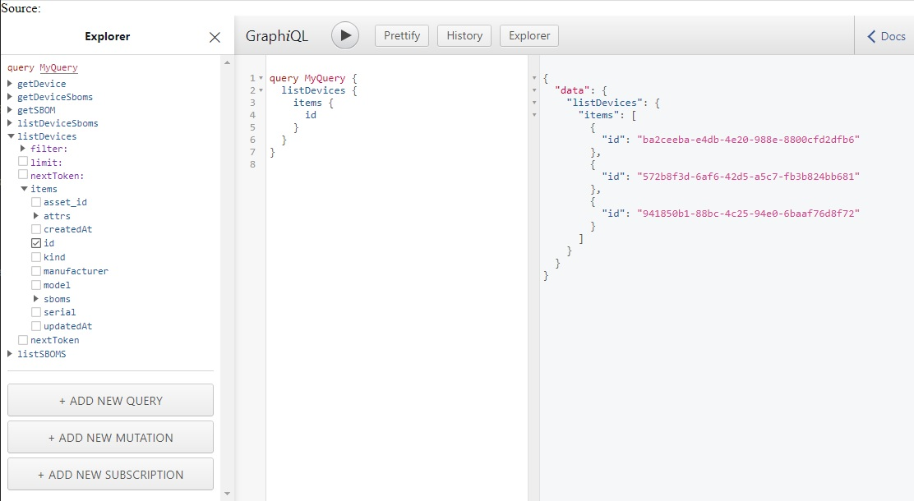
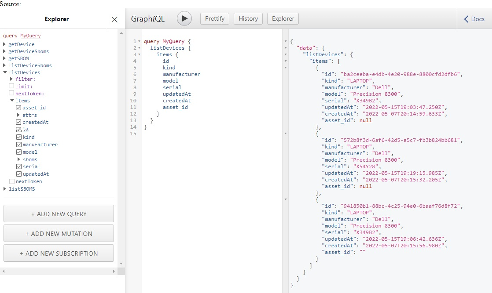
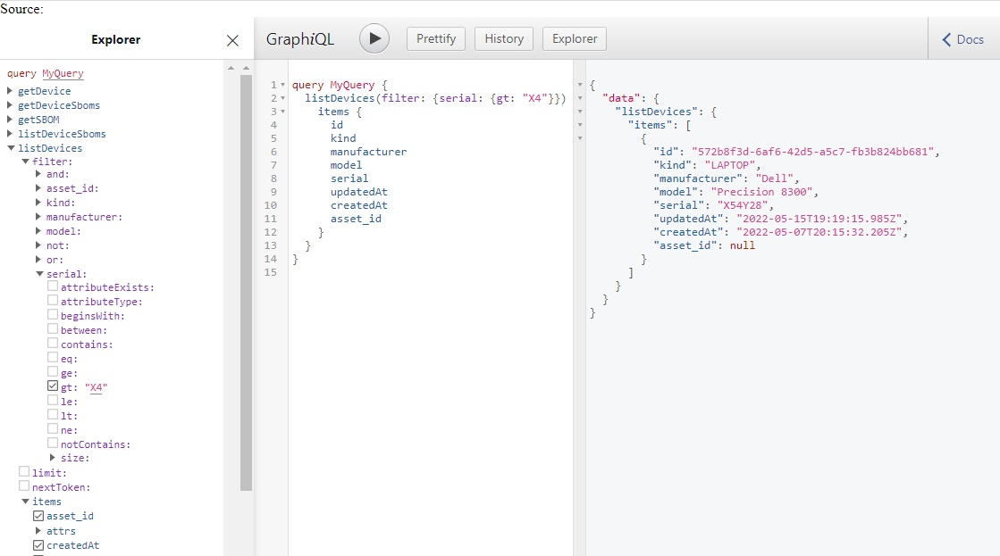
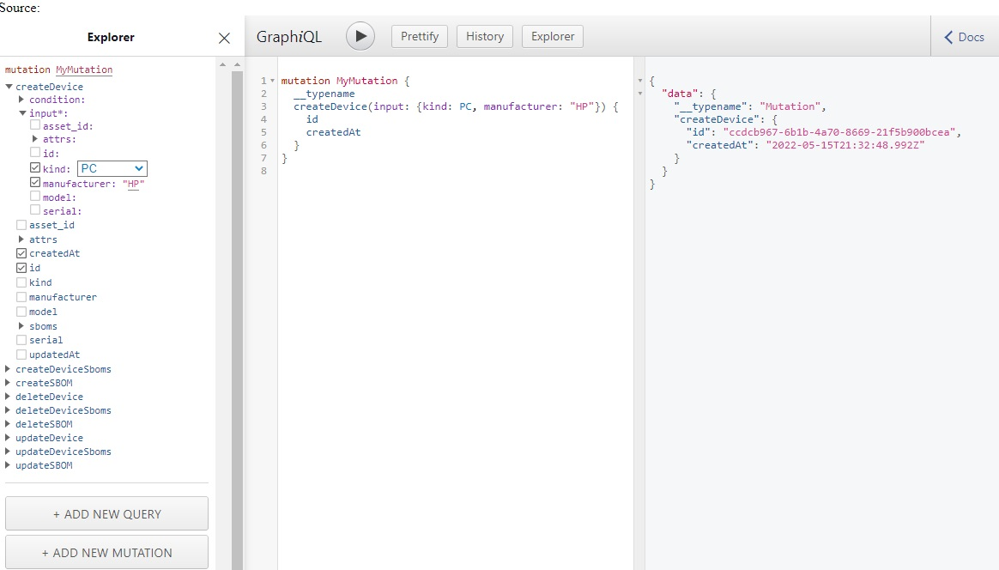

# Posture Attribute Repository

The Security Posture Attribute Collection and Evaluation (PACE)
[Architecture](https://github.com/opencybersecurityalliance/PACE/tree/main/docs/Arch)
includes a Posture Collection Service (PCS), Posture Evaluation Service (PES),
and Posture Attribute Repository (PAR). The PCS is an OpenC2 Consumer that collects
information as directed using the Posture Attribute Collection (PAC)
[actuator profile](https://github.com/oasis-open/openc2-jadn-software/blob/master/ProfileTables/oc2pac-v1.1.md),
which defines the format of collection commands and responses. The PCS then stores
posture information for each device in the PAR.

The [PAR Schema](https://raw.githubusercontent.com/oasis-open/openc2-jadn-software/master/Schemas/par-api.jidl)
includes:
* Device information as supplied by an IT Asset Management service
* Posture information as collected from Devices by the PCS

The Posture portion of the PAR Schema is defined by the Results portion of the PAC actuator profile.
The PAR Schema is translated into
[GraphQL Schema Definition Language (SDL)](par.graphql.txt) for deployment.
This manual translation derives the PAR API from the PAC actuator profile.

## Querying the PAR

1. Open the PAR Proof of Concept using [GraphQL Explorer](par-explorer.html), then
click the Explorer button to open the explorer pane.
2. In the Explorer under MyQuery, open `listDevices` then `items`. 
You should see device information (id, manufacturer, model, serial, etc.) plus posture information
under `attrs` and `sboms`.
3. In the GraphiQL pane, click the Run button to execute the query.  The `id` field should be
added to the query automatically, and the list of device IDs should appear in the results pane:

4. Check additional boxes under "items" to add them to the query, then run the query again:

5. Open the `filter` list, then `serial`, and under `gt` type "X4" and run the query.
Only devices with serial numbers that match the filter should be listed:

## Updating the PAR

The Posture Collection Service uses Mutations to update the contents of the PAR.

6. Click "ADD NEW MUTATION", select `createDevice`,
then under `input` select a `kind` from the menu and type a `manufacturer` name.
Select some results to display (e.g., 'id' and 'createdAt`) and run the mutation:

7. Open the History pane, select the second MyQuery from the top (without the filter)
and run it. The results should show the newly-created device with `null` for fields
that were not included in the createDevice.
8. Copy the `id` field for the new device, click "ADD NEW MUTATION", select `deleteDevice`,
paste the id into the input `id` field, run the mutation, then run the `listDevices` query again
to show that the newly-created device is gone.

*Note that the PAR proof of concept has no access controls and is shared
by all CAW participants. Please play nice.*

<a href="/">return to Home</a>

