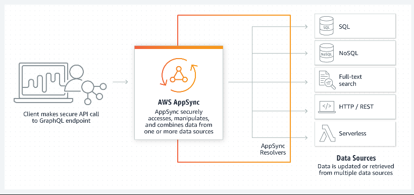

# DoD Sweat Equity

DoD is a cochair and has members of the OpenC2 Technical Committee,
has individual participants in the Security Posture Attribute
Collection and Evaluation
([PACE](https://github.com/opencybersecurityalliance/PACE/tree/main/docs/Arch))
OASIS Open Project,
and sponsors HII to participate in both OpenC2 and PACE.

## 1. Software/Application/Device Contributions
DoD's contributions to the CAW include development of:
* OpenC2 actuator profiles (both PACE and non-PACE related)
* Profile creation and message validation tools
* Posture Attribute Repository (PAR) proof of concept

### 1.1 OpenC2 Actuator Profiles
An actuator profile describes a function performed by a product and defines the API operations
(commands) related to that function. A device may perform the operations defined in one or more
actuator profiles, and a device schema defines which profiles and which optional commands
from each profile are supported. Actuator profiles include:
* [Packet Filtering](https://github.com/oasis-tcs/openc2-ap-pf), 
successor to [Stateless Packet Filtering](https://github.com/oasis-tcs/openc2-apsc-stateless-packet-filter)
* [Software Bill of Materials Retrieval](https://github.com/oasis-open/openc2-jadn-software/blob/master/ProfileTables/oc2ap-sbom-v1.1.md),
to be merged into [SBOM](https://github.com/oasis-tcs/openc2-ap-sbom/tree/working)
* [Posture Attribute Collection](https://github.com/oasis-tcs/openc2-ap-pac)
* [Endpoint Response](https://github.com/oasis-tcs/openc2-ap-er)

### 1.2 Profile Creation and Message Validation Tools
The OpenC2 [JADN Software](https://github.com/oasis-open/openc2-jadn-software) repo contains:
* [Template](https://raw.githubusercontent.com/oasis-open/openc2-jadn-software/master/Schemas/oc2ls-v1.1-ap-template.jadn)
to use when creating new actuator profiles
* [Template](https://raw.githubusercontent.com/oasis-open/openc2-jadn-software/master/Schemas/oc2ls-v1.1-lang.jadn)
to use when developing OpenC2 producer and consumer device schemas
* [Software](https://github.com/oasis-open/openc2-jadn-software/blob/master/make-artifacts.py)
to validate profile and device schemas and translate schemas between multiple formats
* [Software](https://github.com/oasis-open/openc2-jadn-software/blob/master/resolve-references.py)
to resolve external references to produce a self-contained device schema
* Actuator profile and device [schemas](https://github.com/oasis-open/openc2-jadn-software/tree/master/Schemas)
* Example OpenC2 [commands and responses](https://github.com/oasis-open/openc2-jadn-software/tree/master/Test)
for a device supporting each profile
* [Software](https://github.com/oasis-open/openc2-jadn-software/blob/master/test-poc.py)
to validate commands and responses for each device

This software is used both when creating new actuator profiles and when
developing and testing OpenC2 implementations prior to interoperability testing.

### 1.3 Posture Attribute Repository Proof of Concept
Decision-making components will be able to retrieve PACE information from a
Posture Attribute Repository.

Although a specific PAR API has not yet been determined, DoD will develop and make available a PAR proof of concept
implemented on Amazon Web Services using a [GraphQL](https://aws.amazon.com/appsync/) interface*.
CAW participants will be able to query a set of dummy components (IT assets) and a set of random
but syntactically valid example SBOMs associated with those components.
PAR content will be managed exclusively by the Posture Attribute Collection and
Posture Attribute Evaluation systems; all user access is query-only.

`*` [This article](https://www.onegraph.com/blog/post/2/how-onegraph-onboards-users-who-are-new-to-graphql)
provides some background on GraphQL capabilities and our rationale for using it as a PAR API.

**PAR Structure**

Initially the PAR will include two types: Device and SBOM.
* A Device is a physical or virtual processing element owned or managed by an organization.
A device entry includes asset identifying and configuration information
including the SBOM(s) applicable to that device.
* A Software Bill of Materials ([SBOM](https://ntia.gov/SBOM))
is a nested inventory for software, a list of ingredients that make up software components.
An SBOM entry includes the SBOM unique identifier, NTIA's seven
[SBOM minimum elements](https://www.ntia.doc.gov/files/ntia/publications/sbom_minimum_elements_report.pdf),
and the SBOM document in one of several types and data formats.

**Accessing the PAR**

See this [tutorial](PAR/PAR.md) on using the PAR with [GraphQL Explorer](PAR/par-explorer.html).
The CAW PAR proof of concept is a GraphQL protocol endpoint (not a browsable web page) at
https://2uqxczz7pjhcbmzp3ncfehfbdu.appsync-api.us-east-1.amazonaws.com/graphql
that implements the
[PAR API](https://raw.githubusercontent.com/davaya/pace-software/main/Data/par-schema.jidl),
populated with a set of example devices and SBOMs.  The proof-of-concept is available to all
CAW participants and supports all read and write PAR operations. A production PAR would include
access controls to limit writing to PACE components, as well as limiting read access to authorized
users.

[return to Home](../../index.md)
