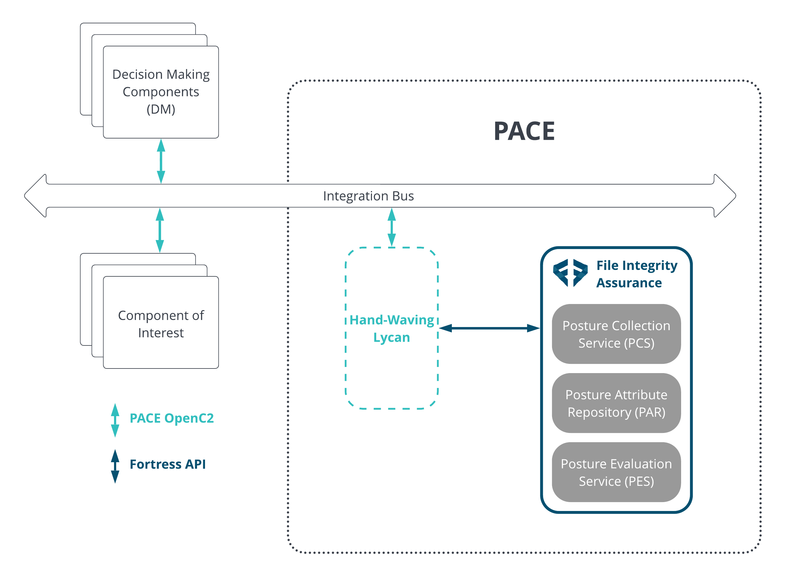

# Fortress Sweat Equity

[Fortress Information Security](https://www.fortressinfosec.com/)
provides holistic overview of cyber security risk by connecting vendors, IT & OT components, and vulnerabilities together.

For the 2022 Cybersecurity Automation Workshop, hosted in Washington, D.C., Fortress will be providing software tools, demo resources, and in-person participation.

Our tools and services are a [Posture Attribute Collection & Evaluation (PACE)](https://github.com/opencybersecurityalliance/PACE) system which will be used to demonstrate PACE use cases. A [PACE architecture](https://github.com/opencybersecurityalliance/PACE/blob/32047124a28a2ab4d68c4e74e9564831cecab923/docs/Arch/README.md) includes  3 components: a Posture Collection Service (PCS) for collecting posture attributes, a Posture Attribute Repository (PAR) for storage and retrieval of attributes, and a Posture Evaluation Service (PES) for using attributes for analysis.

- [File Integrity Assurance (FIA)](https://www.fortressinfosec.com/file-integrity-assurance) can be used for producing, ingesting, and analyzing SBOMs. FIA is a continuous monitoring solution for detected new vulnerabilities in existing components as they are discoverd.

## PACE Use Cases

FIA and Fortress Platform will be used to showcase [PACE use cases](https://github.com/opencybersecurityalliance/PACE/tree/main/docs/UseCases), including:

1. [Collect SBOM with Command](https://github.com/opencybersecurityalliance/PACE/blob/main/docs/UseCases/collect_sbom_with_command.md) using FIA as a Posture Collection Service (PCS).
2. [Retrieve SBOMs](https://github.com/opencybersecurityalliance/PACE/blob/main/docs/UseCases/retrieve_sbom.md) using FIA as a Posture Attribute Repository (PAR), for example:

    - Retrieving an SBOM from the PAR in the same format and serialization originally provided to PACE system
    - Retrieving SBOM from the PAR in a different format than originally provided to PACE system
    - Retrieving SBOM from the PAR in a different serialization than than originally provided to PACE system

3. Requesting a subset of SBOM data using FIA as a Posture Attribute Repository (PAR)

    - For example, requesting data associated with a particular component(s)

4. Evaluation of SBOM data using FIA as the Posture Evaluation Service (PES), for example:

    - Evaluating which products are affected by a particular CVE, such as CVE-2021-20190, a flaw in jackson-databind before version 2.9.10.7.
    - Evaluating which products contain known vulnerable component, such as, log4j v2.15.0.
    - Evaluating the potential vulnerabilities affecting the components found in an SBOM
    - Evaluating component's dependencies and transitive dependencies for out of date versions
    - Evaluating the component's maintainer or contributors for the potential for adversarial influence
    - Evaluating the components for malware, integrity, authenticity issues
    - Evaluating components for License risk, such as if a component can bue used in a commercial product, or if modifications/bugfixes must be released.

### Fortress PACE
As OpenC2 interfaces are still under development, the term ["hand-waving lycan"](http://www.cybersecurityautomationworkshop.org/lycan.html) will be used in places to represent the conversion of PACE interfaces to Fortress APIs.

## Return to Sweat Equity
[return to Sweat Equity](../../SweatEquity)

## Return to Agenda
[return to Agenda](../../Agenda)

## Return to Home
[return to Home](../../index.md)
