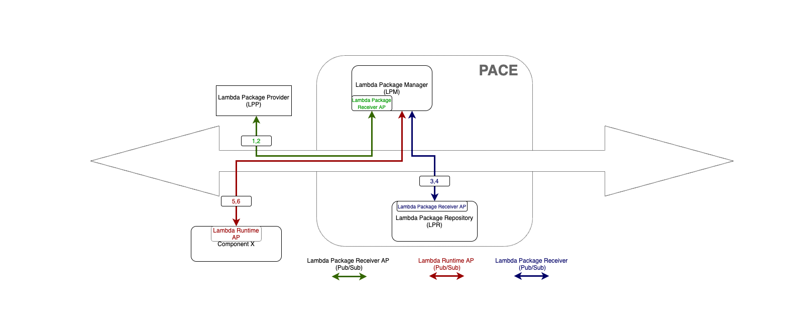

# Individuals Sweat Equity

This is for individuals to submit.
This may be to avoid corporate bureaucracy
or may just be because it's on an individual's own time
and unrelated to their corporate work.

# Custom Analytics on PACE
**Contributor: Abdul Rahman Sattar**

The above diagram is a high-level overview of how PACE could be extended to with Custom Analytics to allow customized analytics jobs to be executed on PACE components. The Custom Analytics can be anything ranging from scripts to complex ETL jobs and Machine Learning Inference Pipeline. These Custom Analytics jobs will be packaged as Lambdas and sent by the Lambda Package Provider to the Lambda Package Manager. The Lambda Package Manager will store these Lambdas in a Lambda Package Repository and schedule them on specified PACE components by sending these Lambdas to the Lambda Runtime running on those PACE components. 

## Return to Sweat Equity
[return to Sweat Equity](../../SweatEquity)

## Return to Agenda
[return to Agenda](../../Agenda)

## Return to Home
[return to Home](../../index.md)
