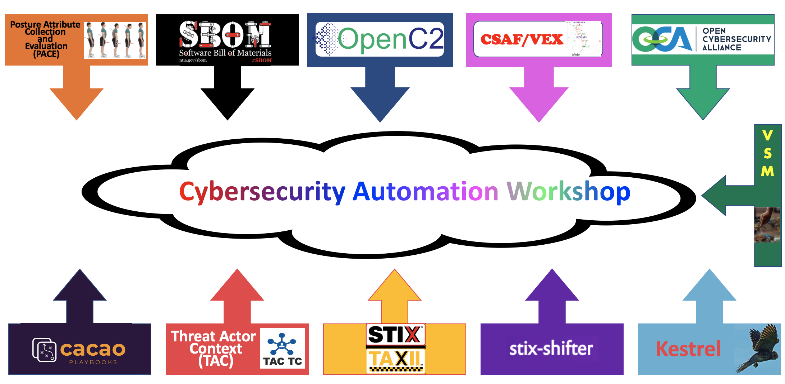

# Cybersecurity Automation Workshop

**Background**

Cybersecurity Automation Workshops are a series of events to prototype and test interoperability
among cybersecurity automation technologies supporting the goals of EO 14028 and the
Open Source Software [Security Mobilization Plan](https://openssf.org/oss-security-mobilization-plan/).
The next Workshop will be held 2-June-2022 at the
[AT&T Forum](https://policyforum.att.com/att-forum/)
in Washington, DC.

[Executive Order 14028](https://www.cisa.gov/executive-order-improving-nations-cybersecurity)
states that "Prevention, detection, assessment, and remediation of cyber incidents
is essential to national and economic security" and establishes requirements for Federal
Information Systems, including:
* (Sec. 3) Modernizing Federal Government Cybersecurity
  * advance toward Zero Trust Architecture
  * accelerate use of secure cloud services
  * streamline access to cybersecurity data
* (Sec. 4) Enhancing Software Supply Chain Security
  * provide purchasers a Software Bill of Materials
* (Sec. 6) Standardizing Federal Government's Playbook for Responding to Cybersecurity
Vulnerabilities and Incidents
* (Sec. 7) Improving Detection of Cybersecurity Vulnerabilities and Incidents

---

## Agenda

The Workshop will take place 9AM-5PM EDT 2 June 2022.

The four keynote speakers will be:
- [Dan Solero](./Dan_Solero.md) (AT&T)
- [Allan Friedman](./Allan_Friedman.md) (CISA)
- [Chuck Brooks](./Chuck_Brooks.md) (Georgetown University)
- [Neal Ziring](./Neal_Ziring.md) (NSA)

The remaining time will be spent either:
- demonstrating interworking parts/all of a use case
   + the hope is much of the details will be worked out prior to the Workshop as to what systems will interoperate on which use case(s)
- trouble shooting interworking
- hackathon to create new lycans or modify interfaces in the spirit of adding new interworking scenarios
- working sessions to work out interfaces (i.e., what it will take to turn ["hand-waving" lycans](./lycan.md) into real interfaces)

See [Agenda](./Agenda.md) for more details.

**Pre-Workshop Homework**:  Prior to the workshop, attendees are encouraged to familiarize
themselves with the organizations participating,
what they will be bringing to the workshop,
and the use cases being demonstrated.
- Please watch the videos at [Videos](./Videos/)
- Please familiarize yourself with the "sweat equity" being provided by participants at [Sweat Equity](/SweatEquity/)
- Please familiarize yourself with the use cases at [use cases](./DemoUseCases/), particularly all [planned interoperation](./DemoUseCases/README.md#4-interoperability-demos) that will take place

The intent is this pre-workshop material will be available by 26-May.

Single or multiple track
is not yet decided
and will depend on
the number and extent of the interworking scenarios,
which will depend
on the sweat equity (so too soon to tell).

---

## Logistics

**Registration**

Registration has closed. If interested, contact organizers.

**Venue**

The [AT&T Forum](https://policyforum.att.com/att-forum/)
is located at 601 New Jersey Avenue NW, Washington, DC 20001.

Thank you to AT&T for hosting the event for us.

Light refreshments will be provided - thanks again to AT&T.

Lunch is being brought in to maximize workshop time - thanks to
[Cybeats](https://www.cybeats.com/).

**COVID**

The workshop will follow AT&T Forum COVID-19 Guidelines
[CovidPg1](./Images/ForumCovid-19GuidelinesPg1.jpg),
[CovidPg1](./Images/ForumCovid-19GuidelinesPg2.jpg).

TL;DR - Vaccination required. Masks required.

**Networking And Work Spaces**

We will have multiple spaces within the Forum, specifically:

  * Large meeting space (Forum 1 & 2), which will be used for keynote presentations and all-participant activities
  * Cafe, which will be used for a mixture of refreshments and meeting space
  * MPR Room, which will be used for meeting space

The large meeting space will be used for keynotes and the morning
non-technical interworking session (see the
[Agenda](./Agenda.md)). The available spaces will be used
flexibly as-needed during the afternoon technical interworking
session.

The Forum will provide secured WiFi (SSID + password) which will
support outbound Internet access (e.g., to connect to the
[HII-provided message brokers](./SweatEquity/HII/README.md)).
Inbound connections will not be supported.

**Remote Access**

Intent is to allow virtual participation. It may not apply to all
sessions or all interoperation demonstrations.

More details will be provided to registered participants nearer the event.

**Eligibility**

Open to all.
Free.
Registration is required.

Should we reach limits (if any)
on the number of physical attendees,
some sort of rules will need to be worked out,
well in advance,
on who is eligible to attend.
Rules would probably
be based on sweat equity,
distance traveled,
a quota (ie to spread attendance across the orgs involved),
with a tie-breaker to who registers first.

---

**Participating Organizations**
Strictly speaking none
(ie workshop is a collection of individuals
getting together to understand and get stuff interoperating
for the common good).
It is an OASIS sponsored event but does not require OASIS membership to attend.

Individuals have already volunteered
contributions bringing together the work of the following:
- [PACE](https://github.com/opencybersecurityalliance/PACE)
- [OpenC2](openc2.org)
- TAC
- CACAO
- SBOM
- LF SPDX
- OWASP CycloneDX
- CSAF
- CTI (ie STIX/TAXII)
- OCA stixshifter
- OCA Kestrel
- ...

To learn more how the work of these organizations
will be specifically used in this workshop,
see
[OrgMashup](./OrgMashup/README.md)

---

**Objective, Goals, Focus**
Attendees should walk away feeling
that they have had a positive engagement
with their peers
and have more confidence
cybersecurity automation
is in a better state
because of effort put into the Workshop.

The objective is demonstrating working interoperating
systems contributing to cybersecurity automation,
particularly across different participants
and across the different standards and organizations
in this mashup of meetups.

The method to achieve the objective will be
demonstration(s) of
[use cases](./DemoUseCases/README.md).

There may be a certain amount of hackathon
to fill in the gaps to complete missing aspects
of the use cases.

The focus of the Workshop is really up to the participants
and what they bring for interworking.
At least some participants are focusing on
PACE use cases involving getting/retrieving/evaluating
SBOMs/VEXs/CVEs/... including the larger context playbooks in
which this is a part, and the subsequent actions taken as a result.

put in pithy meaty example here and ref to rest in use cases.

The Workshop is **NOT** a bakeoff.
The goal is interworking, not 'picking a winner' among multiple standards
(e.g. focus on transforming between SPDX/CycloneDX
instead of focusing on the differences
or which is better for a given ecosystem/usecase).

The Workshop is **NOT** a trade show or beauty pageant.
Vendors (and open source projects) can shill their products
only in the context
of meeting the interworking interfaces
(even if it's with the ["hand-waving" lycan](./lycan.md)).
Consider the Code of Conduct to have "vendor" added to the harassment-free
list. Talk up your value, don't talk down your competitors.

---

## Sweat Equity
To learn more about what participants are bringing
to the workshop, see
[Sweat Equity](./SweatEquity/README.md)

---

## Technical Details for Interoperation
see
[TechDetails](./TechDetails/README.md)
for more details on decisions being made on how to get
stuff to work together.

---

## Demo Use Cases
In the ideal world,
the workshop would perform a live demonstrate
one complicated use case
that evolved from quiet to under attack
touching many different child use cases
involving all the orgs and all the participants.

Being the real world, and early in our
cybsersecurity automation
journey,
the workshop will involve a series of
demonstrations - some live, some tabletop -
touching various interworking scenarios.
And they probalby won't all work,
so a certain amount of hackathon will also
be taking place to add missing lycans or
fixing bugs so that interworking can occur.

More details on exactly is planned is at
[DemoUseCases](./DemoUseCases/README.md)

---

## Results
Eventually results will be put
[here](./Results/README.md)

---

## Previous Events
Results from the two previous workshops,
and other related events,
can be found at
[Previous Workshops](./PrevResults)

---

## Governance
This workshop is being organized by one passionate individual volunteer
who was unelected and will be running it on the
D-cubed model (Duncan/democratic/dictator).
Hopefully others will step in to help and we'll evolve to
spread the joy around.

---

**Code of Conduct**
TL;DR - don't be a jerk.

In the interest of fostering an open and welcoming environment,
we as organizers and participants
pledge to making participation in our projects and our community
a harassment-free experience for everyone,
regardless of age, body size, disability, ethnicity,
sex characteristics, gender identity and expression,
level of experience, education, socio-economic status,
nationality, personal appearance, race, religion,
or sexual identity and orientation.

See [Code of Conduct](./CodeOfConduct.md)
for the complete code of conduct.

---

**Participate**

Join the mailing list:
[https://groups.google.com/g/cybersecurity-automation-workshop-coordination/about](https://groups.google.com/g/cybersecurity-automation-workshop-coordination/about)

Join the organizing committee:
See the mailing list archives for meeting announcements,
surveys, and how to help.

Contribute to this website:
Click on the GitHub button at the top of this page.
See [Contributing](./Contributing2.md)

---

**Support or Contact**

Need help with contributing to this page - click on the github repo
link in the banner at the top

Want to know more? Contact info can be found in the  github repo.

Having trouble with Pages? Check out our [documentation](https://docs.github.com/categories/github-pages-basics/) or [contact support](https://support.github.com/contact) and we’ll help you sort it out.

